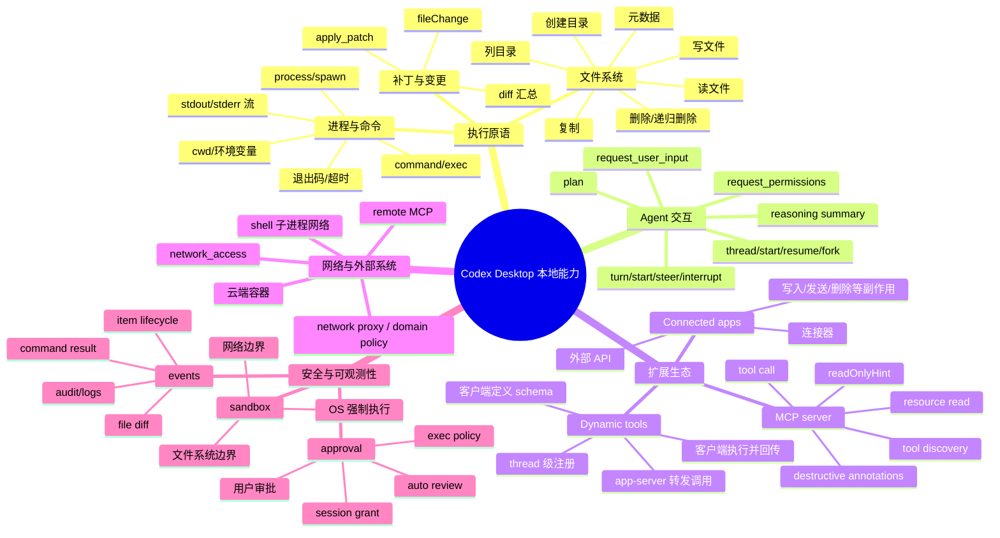
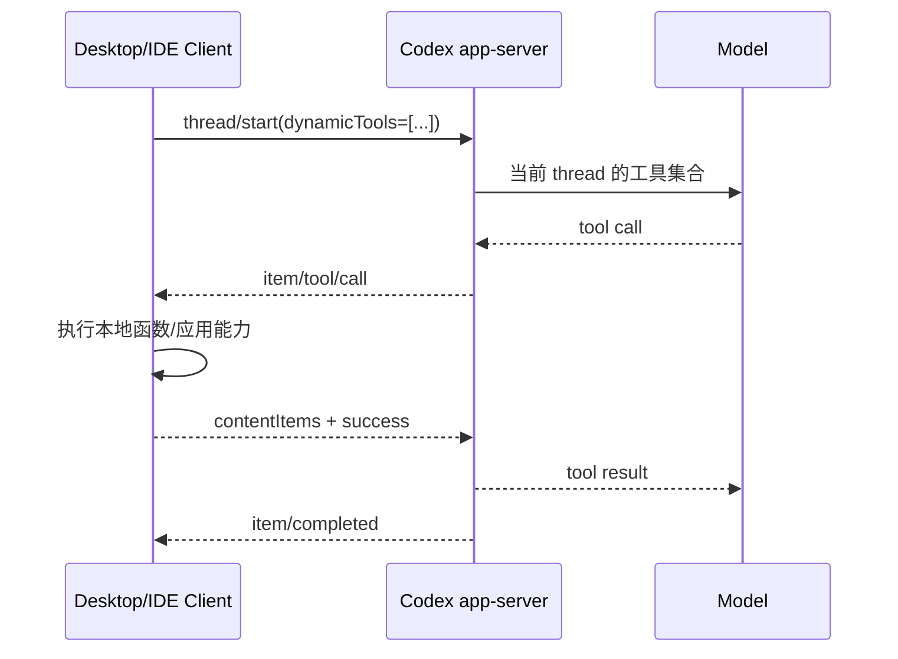
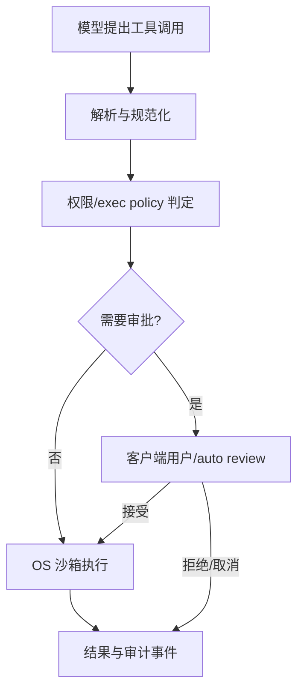
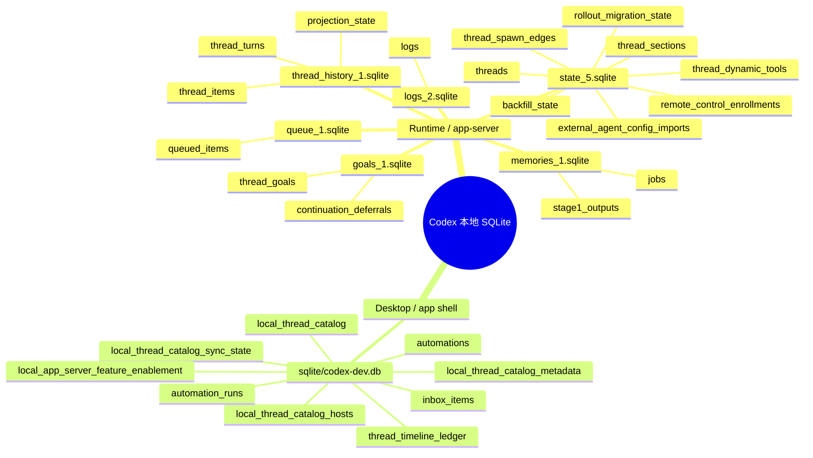
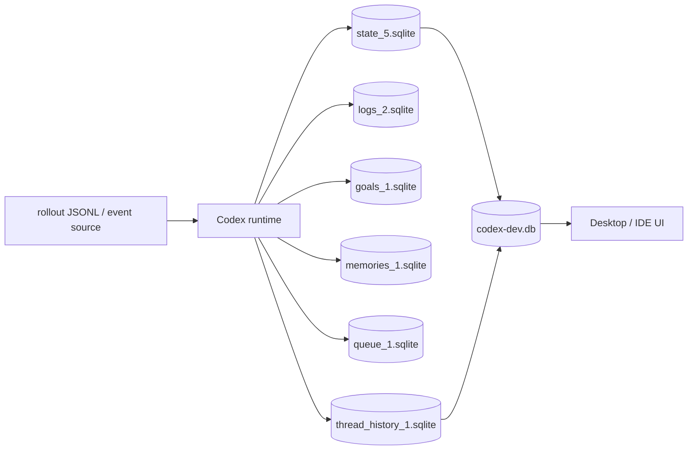

# Codex Desktop 本地工具、风险审批与沙箱：调研笔记

> 调研范围：Codex Desktop / Codex app-server / Codex CLI 的公开协议、官方文档与 OpenAI `codex` 开源仓库。
>
> 结论等级：
> - **已确认**：官方文档或公开源代码直接说明。
> - **架构推断**：由公开协议和事件流推导出的实现边界，不代表 Desktop 私有实现的全部细节。
> - **未知**：Desktop 私有 UI 或服务端策略未公开，不能仅凭外部行为断言。

## 一、先给结论

1. **“客户端本地工具”不是一个扁平列表。** Codex runtime 既有本机内置能力，也能调用 MCP/连接器，还能让客户端通过 `dynamicTools` 注册 thread 级工具。
2. **读写文件、执行命令只是最核心的执行原语。** 对用户可见的能力还包括补丁/文件变更、进程生命周期、目录与元数据、MCP 资源/工具、用户输入、权限申请、线程/任务控制、事件与审计等。
3. **风险控制是两层模型：沙箱 + 审批。** 沙箱从技术上限制“能做什么”；审批策略决定“什么时候必须先问用户”。两者不能互相替代。
4. **高危不是只按工具名判断。** 至少要联合判断：路径是否越过工作区、是否写/删文件、是否启动子进程、是否启用网络、是否触发外部副作用、是否可逆、命令参数是否可能转移执行路径。
5. **审批发生在 app-server 与客户端之间。** app-server 发送服务端发起的 JSON-RPC approval request，Desktop/IDE 客户端显示审批 UI 并回传 `accept`、`acceptForSession`、`decline` 或 `cancel` 等决定。
6. **客户端可以注册工具，但不是永久注册到 OpenAI 全局平台。** `dynamicTools` 是 thread/session 范围的工具描述；agent 调用时由 app-server 反向请求客户端执行。

## 二、总体思维导图



## 三、本地工具能力地图

### 3.1 文件系统原语（直接能力）

这些是 app-server 对客户端/IDE 最直接的本地文件能力，部分也被 agent runtime 用来支撑编辑流程：

| 小类 | 典型能力 | 风险要点 |
|---|---|---|
| 文件读取 | `fs/readFile`、读取源码/配置/日志 | 读取密钥、`.env`、SSH、浏览器资料等敏感路径 |
| 文件写入 | `fs/writeFile` | 覆盖、凭据污染、配置劫持、破坏用户文件 |
| 目录操作 | `fs/createDirectory`、`fs/readDirectory` | 路径穿越、扩大可见范围、创建执行目录 |
| 元数据 | `fs/getMetadata` | 信息泄露、符号链接判断、时间线推断 |
| 复制 | `fs/copy` | 批量外泄、覆盖目标、目录树复制 |
| 删除 | `fs/remove` | 递归删除不可逆，通常应高风险处理 |

官方 app-server 文档把这些列为绝对路径文件系统 API；`fs/remove` 的 `recursive` 与 `force` 默认值都为 `true`，因此自研客户端不应把它当作普通“写文件”操作。([app-server README](https://github.com/openai/codex/blob/main/codex-rs/app-server/README.md))

### 3.2 补丁、编辑与变更确认

这类能力与“直接写文件”不同：agent 先产生结构化变更，客户端可以展示 diff，再决定是否应用。

- `apply_patch`：新增、修改、删除文件。
- `fileChange`：向客户端呈现路径、变更类型和 diff。
- `turn/diff/updated`：提供当前 turn 的聚合 diff。
- `item/fileChange/requestApproval`：文件变更需要批准时发起审批。
- `item/fileChange/patchUpdated`：可选地流式呈现解析中的结构化 patch。

**设计含义：** 编辑 UI 的最小安全单元应是“路径 + 变更类型 + diff + 审批范围”，而不是只显示“Agent 想写文件”。

### 3.3 命令、进程与执行环境

#### 命令执行

- `command/exec`：在服务器沙箱下执行一次命令。
- Agent 产生的 `commandExecution` item：包含命令、cwd、状态、解析后的 `commandActions`、输出、退出码和耗时。
- 运行参数还可能包括超时、输出上限、环境变量、网络策略、额外文件系统权限。

#### 长进程

- `process/spawn`：显式启动进程并获得 process handle。
- `process/outputDelta`：流式输出。
- `process/exited`：进程退出事件。
- 连接关闭时，连接所拥有的活动进程可被终止。

#### 命令“工具”与命令“快捷类别”的区别

`git`、`rg`、`grep`、测试框架、编译器、包管理器、脚本等，通常不是独立的 Codex kernel tool，而是通过 shell/command execution 运行的外部程序。它们仍然必须经过命令解析、exec policy 和沙箱约束。

可按业务语义归类为：

- 仓库检查：`git status/diff/log/show`、文件搜索、目录统计。
- 质量验证：test、lint、typecheck、build。
- 依赖管理：npm/pnpm/yarn/bun/cargo/pip 等。
- 运行服务：dev server、测试 server、脚本进程。
- 系统交互：环境变量、端口、进程、压缩/解压、系统命令。

### 3.4 Agent 会话与用户交互能力

这些不一定是“本地系统工具”，但属于 Desktop 客户端必须承载的 agent 控制面：

- thread：创建、恢复、分叉、列举、归档。
- turn：开始、继续引导、打断。
- plan：计划文本与计划事件。
- reasoning：推理摘要事件，不等于暴露完整内部思维链。
- `request_user_input`：让客户端渲染表单/选项并把用户答案返回给 agent。
- `request_permissions`：让 agent 请求额外的网络或文件系统权限。
- 状态、token usage、错误、事件生命周期：用于 UI、审计和恢复。

### 3.5 MCP 与 Connected Apps

MCP 工具通常不是 Desktop 内置工具，而是外部 server 或连接器暴露的能力：

- 工具发现：获取名称、描述、输入 schema。
- 工具调用：`mcpServer/tool/call`。
- 资源读取：`mcpServer/resource/read`。
- 认证与连接状态：MCP server status、登录、重连。
- 连接器副作用：创建工单、发消息、写数据库、删除资源、发布代码等。

MCP/连接器的风险不能由“不是 shell”推断为低风险。官方文档说明，声明有副作用的连接器工具仍可能要求审批；带 destructive annotation 的工具，即使同时有 read-only 提示，也应始终审批。([Agent approvals and security](https://developers.openai.com/codex/agent-approvals-security))

### 3.6 Dynamic tools：客户端可注册的本地扩展

客户端在 `thread/start` 中提供 `dynamicTools`，每个工具包含名称、描述和输入 schema；也可使用 namespace 和 `deferLoading`。

调用链：



这类工具可以承载：

- IDE 操作：打开文件、跳转符号、获取诊断、应用编辑器命令。
- Desktop 应用状态：当前窗口、选区、标签页、项目选择。
- 本地业务系统：内部脚本、数据库代理、设备控制。
- UI/媒体：返回文本、内联图片或音频 data URL。

**边界：** dynamic tool 的定义和执行者在客户端；agent 是否能调用它由当前 thread 的工具集合决定；它不是全局注册，也不自动突破本地沙箱。

## 四、高危风险如何识别

### 4.1 风险判定输入

建议把一次 tool call 规范化为以下对象，而不是只看工具名：

```text
RiskInput = {
  capability: file | patch | command | process | network | mcp | app | permission,
  targetPaths: absolute paths,
  cwd: absolute path,
  commandTokens: parsed argv / shell AST,
  filesystemDelta: read/write/delete/deny,
  networkDelta: disabled/allowed/domains/proxy,
  externalSideEffect: none | reversible | irreversible,
  dataSensitivity: public | source | secret | personal | production,
  privilegeChange: none | elevated | credential-bearing,
  annotations: readOnlyHint / destructiveHint / app policy,
  reversibility: reversible | recoverable | destructive
}
```

### 4.2 高危因素分类

| 风险类别 | 典型触发 |
|---|---|
| 越界文件访问 | 工作区外读写、路径穿越、符号链接逃逸、访问 `.ssh`/`.env`/密码库 |
| 破坏性变更 | `rm -rf`、递归删除、覆盖关键配置、破坏性 Git 操作、数据库 DROP |
| 外部副作用 | 发邮件、发消息、创建/删除工单、发布、支付、生产写操作 |
| 网络与外传 | 打开网络、向未允许域名发请求、上传源码/凭据、下载并执行内容 |
| 子进程/执行转移 | shell 拼接、管道、重定向、脚本解释器、命令替换、可执行文件下载 |
| 权限提升 | sudo、管理员操作、修改 ACL/策略、安装系统级软件 |
| 凭据与隐私 | 读取 token、环境密钥、浏览器 cookie、个人目录并传给模型或外部服务 |
| 不可逆性 | 删除、发布、迁移、覆盖、杀进程、停止服务 |

### 4.3 命令识别：已公开的实现线索

开源 runtime 将执行审批建模为三态：

- `Skip`：不需要审批，可选择第一次绕过沙箱。
- `NeedsApproval`：需要审批，可附带未来相似命令的 exec-policy amendment。
- `Forbidden`：策略禁止执行。

默认判定会结合 `AskForApproval` 与文件系统沙箱是否受限：`Never` 不问；`OnRequest` / granular 在受限文件系统下可能需要审批；`UnlessTrusted` 默认更严格。([sandboxing.rs](https://github.com/openai/codex/blob/main/codex-rs/core/src/tools/sandboxing.rs))

命令不能只使用字符串黑名单。更可靠的流程是：

1. 解析 argv 或 shell AST。
2. 规范化路径、cwd、解释器和环境变量。
3. 识别管道、重定向、命令替换、脚本解释器、下载后执行等转移路径。
4. 对已知安全命令做“带参数”的白名单，而不是只按程序名放行。
5. 叠加目标路径、网络状态、凭据可见性与副作用等级。
6. 输出 `allow / prompt / deny`，并记录理由。

### 4.4 MCP / App 工具识别

对 MCP 或 connected app，优先使用工具元数据：

- `readOnlyHint = true`：只读提示，可降低默认询问频率。
- `destructiveHint = true`：破坏性提示，必须按高风险处理。
- 工具级 `approval_mode`：覆盖 app 默认策略。
- app 默认模式：`auto`、`prompt`、`writes`、`approve`。

但是元数据是声明，不是安全边界。真正的执行器仍需做服务端/本地权限校验，避免恶意或错误的 MCP server 用“只读”标签伪装写操作。

## 五、风险操作如何获取权限

### 5.1 命令 / 沙箱升级审批

当命令不能在当前沙箱中执行，或者策略要求确认时，app-server 向客户端发送 approval request。客户端应在当前 turn 中展示：

- 完整命令与参数。
- cwd。
- 将要读取/写入的路径。
- 网络是否开启、目标域名/代理策略。
- 风险理由、是否可逆。
- 本次批准还是本 session 批准。

典型决定：

```text
accept
acceptForSession
acceptWithExecpolicyAmendment
applyNetworkPolicyAmendment
decline
cancel
```

官方 app-server 还支持 `auto_review`：由专门的审查 agent 在配置允许时分析上下文并代替用户决定，但这不是“取消风险”，只是把审批决策者从用户 UI 换成受约束的自动审查器。([app-server approvals](https://github.com/openai/codex/blob/main/codex-rs/app-server/README.md))

### 5.2 文件变更审批

文件写入采用单独的 file-change 生命周期：

```text
item/started(fileChange)
  → item/fileChange/requestApproval
  → client: accept / acceptForSession / decline / cancel
  → serverRequest/resolved
  → item/completed(fileChange)
```

客户端应先渲染 diff，再让用户决定。UI 不应把“写入整个工作区”当作一个不可分解的全局开关；至少要显示根目录、文件列表和变更类型。

### 5.3 额外权限申请

内置 `request_permissions` 工具可以请求：

- 额外工作区根目录。
- 额外文件系统读取/写入路径。
- 网络访问。

客户端返回的权限只能是请求子集；未返回的权限视为拒绝。权限可以是 turn 级，也可以设为 session 级；同一 turn 内已授予的权限可被后续 shell-like 调用复用。([app-server permission requests](https://github.com/openai/codex/blob/main/codex-rs/app-server/README.md))

## 六、沙箱如何设计

### 6.1 两层模型



- **沙箱层**：限制路径、网络、进程能力、权限提升和系统调用。
- **审批层**：决定是否暂停并征求授权。
- **策略层**：给出 allow/prompt/deny、会话持久化和命令规则。
- **审计层**：记录请求、决定、实际执行结果和 diff。

### 6.2 默认边界

官方安全文档说明，本地 Codex 默认使用 OS 强制执行的沙箱，通常限制到活动工作区，且默认关闭网络；`workspace-write` 允许工作区内编辑/执行，工作区外编辑或网络访问需要审批。云端则在隔离容器中运行，setup 阶段可联网安装依赖，agent 阶段默认离线，setup secrets 在 agent 阶段前移除。([Agent approvals and security](https://developers.openai.com/codex/agent-approvals-security))

常见策略组合：

| 模式 | 文件系统 | 网络 | 审批 |
|---|---|---|---|
| `read-only` | 只读 | 默认关闭 | 编辑、命令、网络通常需问 |
| `workspace-write` + `on-request` | 工作区可写 | 默认关闭 | 越界写入、网络、需要升级的命令需问 |
| `workspace-write` + `untrusted` | 工作区可写 | 默认关闭 | 不可信命令需问 |
| `danger-full-access` / `yolo` | 无沙箱 | 不受沙箱限制 | 无审批，不建议 |

### 6.3 平台实现（公开仓库线索）

公开仓库显示，Codex 采用平台原生/平台适配的强制机制：

- **macOS**：Seatbelt（`/usr/bin/sandbox-exec`），按解析后的文件系统与网络策略生成 profile。
- **Linux**：当前路径可使用 bubblewrap；兼容场景可使用 Landlock；还会结合 `PR_SET_NO_NEW_PRIVS` 与 seccomp 网络过滤。
- **Windows**：Windows sandbox / restricted-token backend；更复杂的精确读写策略可能需要 elevated backend，无法强制时应 fail closed，而不是无沙箱运行。

这些是开源 runtime 的实现线索，不应把某个具体版本的内部开关当成 Desktop 永久 API。([core README](https://github.com/openai/codex/blob/main/codex-rs/core/README.md), [linux sandbox README](https://github.com/openai/codex/blob/main/codex-rs/linux-sandbox/README.md), [Windows sandbox source](https://github.com/openai/codex/blob/main/codex-rs/sandboxing/src/windows.rs))

### 6.4 重要安全细节

- **拒绝读取（deny-read）不能靠“批准后直接取消沙箱”实现。** 如果取消沙箱，原本的 deny-read 约束会消失；runtime 在这种情况下会保留沙箱并拒绝不安全升级。
- **网络应该独立建模。** “文件写入已批准”不等于“网络也已批准”。网络要有独立开关、域名策略和代理策略。
- **外部 MCP 需要单独的信任边界。** MCP server 可以访问自身环境，Codex 的本地文件沙箱不会自动约束远程服务。
- **路径必须做绝对化和规范化。** 需要处理符号链接、`..`、大小写、挂载点、Windows junction、网络盘等边界。
- **执行器必须 fail closed。** 如果底层平台不能准确表达某个权限 profile，应拒绝执行或要求更强的受控环境，而不是退化成宿主机全权限。

## 七、面向自研 Electron 客户端的落地建议

如果目标是实现一个类似 Codex Desktop 的本地 agent 宿主，建议把能力拆成以下服务边界：

```text
Renderer UI
  ├─ Approval Center（命令 / 文件变更 / MCP / 权限）
  ├─ Diff & Audit Viewer
  └─ Thread / Turn Controller

Preload / IPC（窄接口）
  ├─ app-server JSON-RPC bridge
  ├─ approval response bridge
  └─ event stream bridge

Main Process（可信边界）
  ├─ command broker
  ├─ filesystem broker
  ├─ sandbox launcher
  ├─ MCP manager
  ├─ dynamic-tool registry
  └─ policy / audit store

Sandboxed Worker / Exec Server
  ├─ command execution
  ├─ process lifecycle
  └─ network proxy
```

必须遵守的原则：

1. Renderer 不直接拥有 Node.js、shell 或任意文件系统能力。
2. 所有本地能力都经过 Main/Preload 的窄接口和统一 policy engine。
3. 工具 schema、实际执行器、风险级别、审批策略分离存储。
4. dynamic tool 注册必须绑定 `threadId`、客户端连接和 capability token。
5. 每次调用都重新做权限检查，不能仅相信模型先前看到的 schema。
6. 审批结果使用最小权限子集，并明确 turn/session 生命周期。
7. 所有写入、删除、网络外传和外部副作用都有审计记录。
8. 底层沙箱能力缺失时拒绝运行，不自动降级到 full access。

## 八、已确认与未确认边界

### 已确认

- app-server 使用双向 JSON-RPC；客户端承载审批 UI 和 dynamic tool 的执行回调。
- app-server 有文件系统 API、命令执行 API、MCP tool/resource API，以及 `request_permissions` 流程。
- Codex runtime 将 command/file change/MCP/connected-app 等能力纳入不同的生命周期与审批路径。
- 本地默认沙箱通常关闭网络并限制工作区写入；审批和沙箱是两套协同控制。
- 开源 runtime 公开了 macOS Seatbelt、Linux bubblewrap/Landlock、Windows restricted-token 等实现线索。

### 未确认 / 不应过度推断

- Codex Desktop 私有 UI 是否把所有底层 API 原样暴露给用户。
- Desktop 当前版本内部是否还有未公开的工具、特定工具白名单或服务端 feature flag。
- OpenAI 云端模型服务内部如何挑选具体工具，不能仅从客户端事件名称推断。
- 某个 MCP server 的安全性；工具声明本身不能替代服务端授权。

## 九、参考资料

- [Codex app-server README](https://github.com/openai/codex/blob/main/codex-rs/app-server/README.md)
- [Codex Agent approvals and security](https://developers.openai.com/codex/agent-approvals-security)
- [Codex permissions](https://developers.openai.com/codex/permissions)
- [Codex core README / sandbox matrix](https://github.com/openai/codex/blob/main/codex-rs/core/README.md)
- [Codex Linux sandbox README](https://github.com/openai/codex/blob/main/codex-rs/linux-sandbox/README.md)
- [Codex sandboxing approval logic](https://github.com/openai/codex/blob/main/codex-rs/core/src/tools/sandboxing.rs)
- [Codex Windows sandbox implementation](https://github.com/openai/codex/blob/main/codex-rs/sandboxing/src/windows.rs)

---

## 十、Codex 本地 SQLite 设计

### 10.1 先区分两套数据库体系

Codex 本地持久化不是单一数据库，而是两套边界不同的 SQLite 体系：

1. **Codex runtime / app-server 状态库**：由开源 Rust runtime 管理，默认位于 `CODEX_HOME`（通常是 `~/.codex`）。它保存线程索引、日志、目标、记忆任务、用户消息队列和分页线程历史。
2. **Codex Desktop 应用库**：位于桌面应用自己的数据目录下，例如当前 macOS 本机发现的 `~/.codex/sqlite/codex-dev.db`。它保存 Desktop 级的线程目录聚合、自动化、收件箱、feature enablement 和时间线 ledger，不等同于 runtime 的 thread state DB。

因此“有多少个数据库”有两个答案：

| 口径 | 数量 | 说明 |
|---|---:|---|
| 开源 Codex runtime 定义 | 6 个 | `state_5.sqlite`、`logs_2.sqlite`、`goals_1.sqlite`、`memories_1.sqlite`、`queue_1.sqlite`、`thread_history_1.sqlite` |
| 当前本机实际发现 | 5 个 runtime / 1 个 Desktop DB | 当前未发现 `queue_1.sqlite` 和 `thread_history_1.sqlite`；它们按需创建。另有 `sqlite/codex-dev.db` |

`logs_2.sqlite`、`state_5.sqlite` 这类名字中的数字是迁移/兼容演进后的文件名，不应理解为第 2 个、第 5 个业务库。数据库内部另有 `_sqlx_migrations` 表记录迁移版本。

### 10.2 数据库总览思维导图



### 10.3 Runtime 数据库逐库说明

#### A. `state_5.sqlite`：线程元数据与运行时索引

这是 runtime 的主状态库，职责是“线程可发现、可排序、可恢复，以及与其他运行时对象关联”。它不承担完整的对话正文；完整 rollout 仍主要由 rollout 文件/历史投影承载。

##### `threads`

| 字段 | 类型 | 作用 |
|---|---|---|
| `id` | TEXT PK | thread ID |
| `rollout_path` | TEXT | 对应 rollout 文件路径 |
| `created_at`, `updated_at` | INTEGER | 秒级创建/更新时间 |
| `created_at_ms`, `updated_at_ms` | INTEGER | 毫秒级时间，逐步替代秒级排序 |
| `recency_at`, `recency_at_ms` | INTEGER | 产品侧最近活跃时间 |
| `source` | TEXT | 会话来源，如 CLI/app/IDE 等 |
| `thread_source` | TEXT NULL | 更细的来源分类 |
| `model_provider` | TEXT | 模型提供方 |
| `model` | TEXT NULL | 最近使用模型 |
| `reasoning_effort` | TEXT NULL | 最近推理档位 |
| `cwd` | TEXT | 工作目录 |
| `title` | TEXT | 推断/持久化标题 |
| `name` | TEXT NULL | 用户显式名称 |
| `preview` | TEXT | 列表展示摘要/预览 |
| `first_user_message` | TEXT | 首条用户消息摘要/文本 |
| `cli_version` | TEXT | 创建线程的 CLI 版本 |
| `sandbox_policy` | TEXT | 沙箱策略快照 |
| `approval_mode` | TEXT | 审批策略快照 |
| `tokens_used` | INTEGER | 最近累计 token 使用量 |
| `has_user_event` | INTEGER | 是否出现用户事件的布尔标记 |
| `archived`, `archived_at` | INTEGER / INTEGER NULL | 归档状态与时间 |
| `is_pinned` | INTEGER | 是否置顶 |
| `thread_section_id` | TEXT NULL | 所属用户分组 |
| `section_position` | INTEGER NULL | 分组内稀疏排序位置 |
| `section_entered_at_ms` | INTEGER NULL | 最近进入分组时间 |
| `memory_mode` | TEXT | 线程记忆模式 |
| `agent_nickname`, `agent_role`, `agent_path` | TEXT NULL | 子 agent 标识、角色和路径 |
| `history_mode` | TEXT | `legacy` 或分页历史等持久化契约 |
| `git_sha`, `git_branch`, `git_origin_url` | TEXT NULL | 创建/最近观察到的 Git 上下文 |

关键索引包括：按创建、更新时间、recency、归档状态、cwd、来源、provider、section、置顶和“可见 preview”过滤的组合索引。这样 Desktop/IDE 列表可以使用 keyset pagination，而不是扫描 rollout 正文。

##### `thread_dynamic_tools`

| 字段 | 类型 | 作用 |
|---|---|---|
| `thread_id` | TEXT | 所属线程 |
| `position` | INTEGER | 工具在注册列表中的稳定顺序 |
| `name` | TEXT | 工具名 |
| `description` | TEXT | 工具说明 |
| `input_schema` | TEXT | JSON Schema 文本 |
| `defer_loading` | INTEGER | 是否延迟加载到模型工具列表 |
| `namespace` | TEXT NULL | 动态工具 namespace |

主键为 `(thread_id, position)`，并通过外键级联删除。它体现了上一问中的结论：dynamic tool 是 thread 级注册，而不是全局永久注册。

##### 其他 state 表

| 表 | 字段/结构 | 职责 |
|---|---|---|
| `thread_spawn_edges` | `parent_thread_id`, `child_thread_id` PK, `status` | 记录父子 agent/thread 关系 |
| `thread_sections` | `id` PK, `name`, `appearance` JSON | 用户自定义线程分组及外观 |
| `remote_control_enrollments` | websocket/account/client 三元主键，外加 server/environment 信息、更新时间、启用标记 | 远程控制注册关系 |
| `external_agent_config_imports` | import ID、完成时间、成功/失败 JSON、provider | 外部 agent 配置导入幂等记录 |
| `backfill_state` | 单例 `id=1`、status、watermark、last_success_at、updated_at | rollout 元数据回填进度 |
| `rollout_migration_state` | migration ID、最后检查线程游标、更新时间 | rollout 迁移游标 |
| `rollout_migration_skipped_rollouts` | migration ID、rollout path、size、mtime、skip reason、skipped_at | 记录可安全跳过的未迁移 rollout |

当前本机的 `state_5.sqlite` 已有 `threads`、动态工具、spawn edges、sections、远程控制、配置导入和 backfill 等对象；其中 `rollout_migration_*` 可能在当前版本迁移后按需建立或由更完整的运行时创建。

#### B. `logs_2.sqlite`：结构化日志库

此库从主 state 库拆出，用于降低日志写入对线程列表和状态读写的锁竞争。

##### `logs`

| 字段 | 类型 | 作用 |
|---|---|---|
| `id` | INTEGER PK AUTOINCREMENT | 日志顺序 ID |
| `ts` | INTEGER | 秒级时间 |
| `ts_nanos` | INTEGER | 纳秒补充精度 |
| `level` | TEXT | 日志级别 |
| `target` | TEXT | tracing target |
| `feedback_log_body` | TEXT NULL | 可供反馈/诊断使用的日志正文 |
| `module_path` | TEXT NULL | Rust module |
| `file` | TEXT NULL | 源文件 |
| `line` | INTEGER NULL | 源码行 |
| `thread_id` | TEXT NULL | 关联 thread；可为空 |
| `process_uuid` | TEXT NULL | 关联进程；可为空 |
| `estimated_bytes` | INTEGER | 用于分区配额和日志裁剪的估算大小 |

索引按时间、thread、process 和 threadless process+时间建立。runtime 还按 thread/process 分区控制保留量，因此这是诊断/审计数据，不是对话历史主存储。

#### C. `goals_1.sqlite`：显式 Goal 状态

##### `thread_goals`

| 字段 | 类型 | 作用 |
|---|---|---|
| `thread_id` | TEXT PK | 一个 thread 对应一个 goal 记录 |
| `goal_id` | TEXT | goal 标识 |
| `objective` | TEXT | 目标描述 |
| `status` | TEXT | `active`、`paused`、`blocked`、`usage_limited`、`budget_limited`、`complete` |
| `token_budget` | INTEGER NULL | token 预算 |
| `tokens_used` | INTEGER | 已使用 token |
| `time_used_seconds` | INTEGER | 已使用时间 |
| `created_at_ms` | INTEGER | 创建时间 |
| `updated_at_ms` | INTEGER | 更新时间 |

##### `thread_goal_continuation_deferrals`

只有 `thread_id` 一个主键字段，并引用 `thread_goals(thread_id)`。它表示某个 thread 的 goal continuation 被延后，删除主 goal 时级联删除。

#### D. `memories_1.sqlite`：记忆提取与后台任务

##### `stage1_outputs`

| 字段 | 类型 | 作用 |
|---|---|---|
| `thread_id` | TEXT PK | 线程标识 |
| `source_updated_at` | INTEGER | 源 rollout 最后更新时间 |
| `raw_memory` | TEXT | 阶段一提取的原始记忆 |
| `rollout_summary` | TEXT | rollout 摘要 |
| `rollout_slug` | TEXT NULL | rollout slug |
| `generated_at` | INTEGER | 生成时间 |
| `usage_count` | INTEGER NULL | 使用次数 |
| `last_usage` | INTEGER NULL | 最近使用时间 |
| `selected_for_phase2` | INTEGER | 是否选入阶段二整合 |
| `selected_for_phase2_source_updated_at` | INTEGER NULL | 被选入时对应的源更新时间 |

##### `jobs`

复合主键为 `(kind, job_key)`，字段包括 `status`、`worker_id`、`ownership_token`、`started_at`、`finished_at`、`lease_until`、`retry_at`、`retry_remaining`、`last_error`、`input_watermark`、`last_success_watermark`。它是一个带租约、重试和水位线的轻量后台任务表，用于避免多个 worker 重复生成记忆。

#### E. `queue_1.sqlite`：持久化用户消息队列

该库由当前开源 runtime 定义，但本机当前没有创建文件。其唯一业务表为 `queued_items`：

| 字段 | 类型 | 作用 |
|---|---|---|
| `id` | TEXT PK | 队列项 ID |
| `thread_id` | TEXT | 目标线程 |
| `payload_json` | TEXT | 用户提交内容的 JSON |
| `queue_order` | INTEGER | 线程内顺序 |
| `created_at_ms` | INTEGER | 入队时间 |
| `updated_at_ms` | INTEGER | 更新时间 |

唯一索引 `(thread_id, queue_order)` 保证同一个线程的有序用户提交不冲突。

#### F. `thread_history_1.sqlite`：分页线程历史投影

该库同样由当前开源 runtime 定义，但本机当前未发现文件。它的职责是把 rollout 文件中的事件逐步投影成可分页的 thread/turn/item 关系，避免每次打开历史都从头扫描大 JSONL。

##### `thread_turns`

| 字段 | 类型 | 作用 |
|---|---|---|
| `thread_id`, `turn_id` | TEXT | 复合主键，线程和 turn |
| `rollout_ordinal` | INTEGER | rollout 中的顺序游标 |
| `status` | TEXT | turn 状态 |
| `error_json` | TEXT NULL | 错误结构 |
| `started_at`, `completed_at` | INTEGER NULL | 起止时间 |
| `duration_ms` | INTEGER NULL | 持续时间 |
| `first_user_item_id` | TEXT NULL | 首个用户 item |
| `final_agent_item_id` | TEXT NULL | 最终 agent item |
| `rollout_byte_offset` | INTEGER NULL | 对应 rollout 起始字节偏移 |
| `rollout_end_ordinal`, `rollout_end_byte_offset` | INTEGER NULL | turn 结束游标 |

##### `thread_items`

| 字段 | 类型 | 作用 |
|---|---|---|
| `thread_id`, `turn_id`, `item_id` | TEXT | 复合主键 |
| `rollout_ordinal` | INTEGER | item 的 rollout 顺序 |
| `created_at_ms` | INTEGER | 创建时间 |
| `updated_at_ordinal` | INTEGER | 最近更新对应的 rollout 序号 |
| `item_type` | TEXT | 预抽取的 item 类型，便于过滤用户消息 |
| `item_json` | TEXT | 完整 item JSON |

##### `thread_history_projection_state`

| 字段 | 类型 | 作用 |
|---|---|---|
| `thread_id` | TEXT PK | 线程标识 |
| `next_rollout_byte_offset` | INTEGER | 下次投影从 rollout 的哪个字节继续 |
| `next_rollout_ordinal` | INTEGER | 下次投影从哪个顺序号继续 |

这体现的是“文件为事件源、SQLite 为查询投影”的设计，而不是把完整会话只存进 SQLite。

### 10.4 Desktop 独立库：`sqlite/codex-dev.db`

当前本机的 `~/.codex/sqlite/codex-dev.db` 是 Desktop 应用级数据库，`PRAGMA user_version = 30`，不使用 Codex runtime 的 `_sqlx_migrations` 表。它更像一个本地应用 read model / catalog store：把来自不同 host 的 thread 元数据汇总到统一桌面列表，并保存桌面自动化与通知状态。

#### `local_thread_catalog`

| 字段 | 类型 | 作用 |
|---|---|---|
| `host_id`, `thread_id` | TEXT | 复合主键，支持多个 host 上同 ID 的线程 |
| `display_title` | TEXT | Desktop 列表展示标题 |
| `source_created_at`, `source_updated_at` | REAL | 来源 host 的时间戳 |
| `cwd` | TEXT | 来源工作目录 |
| `source_kind` | TEXT | 来源类型 |
| `source_detail` | TEXT NULL | 来源附加信息 |
| `model_provider` | TEXT | 模型提供方 |
| `git_branch` | TEXT NULL | Git 分支 |
| `observation_sequence` | INTEGER | 观测顺序 |
| `missing_candidate` | INTEGER | 是否可能已从来源消失 |
| `thread_source` | TEXT NULL | 线程来源分类 |
| `source_recency_at` | REAL | 来源最近活跃时间 |
| `pending_observed_title` | INTEGER | 标题是否待确认/待回写 |

索引覆盖 host、cwd、created、updated/recency，并过滤 `missing_candidate = 0`。这说明 Desktop 列表不是直接把 renderer 绑定到某一个 runtime DB，而是维护跨 host 的 catalog。

#### `local_thread_catalog_hosts`

| 字段 | 类型 | 作用 |
|---|---|---|
| `host_id` | TEXT PK | 主机/执行环境 ID |
| `host_kind` | TEXT | 约束为 `local`、`ssh`、`wsl`、`remote-control` |

#### `local_thread_catalog_sync_state`

| 字段 | 类型 | 作用 |
|---|---|---|
| `host_id` | TEXT PK | 同步对象 |
| `watermark_updated_at` | REAL NULL | 增量同步时间水位 |
| `initial_build_complete` | INTEGER | 是否完成首次构建 |
| `observation_sequence` | INTEGER | 观测序列 |
| `last_full_reconciled_at` | INTEGER NULL | 最近全量校准时间 |

#### `local_thread_catalog_metadata`

单例 `id = 1`，字段 `catalog_revision`。用于让 UI 或多个同步消费者知道 catalog 是否发生变化。

#### `thread_timeline_ledger`

| 字段 | 类型 | 作用 |
|---|---|---|
| `host_id`, `thread_id`, `sequence` | TEXT/TEXT/INTEGER | 复合主键，按 host/thread/序列定位事件 |
| `record_id` | TEXT | 去重标识；与 host/thread 组成唯一约束 |
| `payload_json` | TEXT | 时间线事件载荷 |

该表使用 `WITHOUT ROWID`，适合以复合主键读取和幂等写入 timeline 记录。

#### Desktop 自动化、收件箱和 feature 状态

| 表 | 关键字段 | 职责 |
|---|---|---|
| `automations` | `id`, `name`, `prompt`, `status`, `next_run_at`, `last_run_at`, `cwds`, `rrule`, `model`, `reasoning_effort`, `target_type`, `project_id` | 计划任务/自动化定义；`cwds` 为 JSON 数组，`rrule` 为重复规则 |
| `automation_runs` | `thread_id` PK, `automation_id`, `status`, `read_at`, 标题/摘要/cwd、时间、归档消息与原因 | 一次自动化执行对应的线程及收件箱状态 |
| `inbox_items` | `id`, `title`, `description`, `thread_id`, `read_at`, `created_at` | Desktop 收件箱条目 |
| `local_app_server_feature_enablement` | `feature_name` PK, `enabled`, `updated_at` | 本地 app-server feature 开关覆盖 |

### 10.5 SQLite 运行参数与一致性设计

公开 runtime 的 SQLite 连接层显示：

- 写库使用 **WAL** journal mode。
- `synchronous = NORMAL`。
- 新库使用 incremental auto-vacuum。
- busy timeout 为 5 秒。
- 每个 runtime DB 使用最多 5 个连接；只读检查池使用单连接。
- 每个数据库独立迁移器和独立连接池。
- 主 state、logs、goals、memories、queue、thread history 分库，核心目的之一是降低锁竞争和让高频日志/历史投影不阻塞线程元数据。

你当前使用 `sqlite3` 只读查看时看到 `journal_mode=delete`，这是因为打开的是 immutable/只读快照或当前连接没有以 runtime 的写连接方式初始化；不能据此否定 runtime 源码里的 WAL 配置。原始目录同时存在 `-wal`/`-shm` sidecar，反而是 WAL 活跃过的直接证据。

### 10.6 数据流关系



### 10.7 安全与隐私注意事项

- `threads.first_user_message`、`preview`、`title`、`rollout_path` 可能包含用户输入、项目路径或敏感上下文。
- `logs.feedback_log_body` 和 `thread_items.item_json` 可能包含工具参数、错误输出或代码片段。
- `memories_1.sqlite.stage1_outputs.raw_memory` 是高敏感度记忆数据，不应作为普通缓存上传或同步。
- `codex-dev.db.automations.prompt` 可能包含长期自动化指令；`automation_runs.archived_*` 可能保留执行摘要。
- 数据库 schema 本身不代表权限边界。读取 SQLite 文件通常等同于绕过 UI 审批，因此文件系统权限、OS 用户权限和磁盘加密仍是第一道边界。

### 10.8 已确认与仍未知

**已确认：**

- 开源 runtime 明确定义 6 个 SQLite 文件及对应迁移目录。
- `state_5.sqlite` 是线程元数据/动态工具/运行时关系的主库；日志、goal、记忆和队列分库。
- `thread_history_1.sqlite` 是分页历史投影库，使用 `thread_turns`、`thread_items` 和 projection state。
- 当前本机存在独立的 `sqlite/codex-dev.db`，它是 Desktop catalog/automation 数据库。

**仍未知：**

- `codex-dev.db` 的完整迁移源码目前没有在公开 `openai/codex` runtime 仓库中发现；上文对其职责来自本机 schema、表名、索引与运行进程的证据。
- Desktop 私有版本是否会在升级时重命名 `codex-dev.db`、增加 shadow tables 或迁移旧表，不能仅凭当前 schema 推断。
- rollout JSONL 的完整 event schema 和 Desktop timeline payload 的所有类型不应仅根据 SQLite 列名猜测。

## 十一、SQLite 调研参考资料

- [Codex SQLite connection/runtime source](https://github.com/openai/codex/blob/main/codex-rs/state/src/sqlite.rs)
- [Codex state runtime](https://github.com/openai/codex/blob/main/codex-rs/state/src/runtime.rs)
- [State migrations](https://github.com/openai/codex/tree/main/codex-rs/state/migrations)
- [Logs migrations](https://github.com/openai/codex/tree/main/codex-rs/state/logs_migrations)
- [Goals migrations](https://github.com/openai/codex/tree/main/codex-rs/state/goals_migrations)
- [Memory migrations](https://github.com/openai/codex/tree/main/codex-rs/state/memory_migrations)
- [Queue migrations](https://github.com/openai/codex/tree/main/codex-rs/state/queue_migrations)
- [Thread-history migrations](https://github.com/openai/codex/tree/main/codex-rs/state/thread_history_migrations)
- [Codex rollout/state DB integration](https://github.com/openai/codex/blob/main/codex-rs/rollout/src/state_db.rs)
