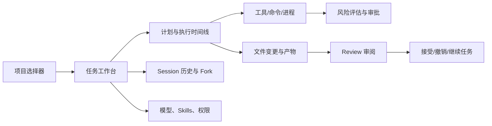
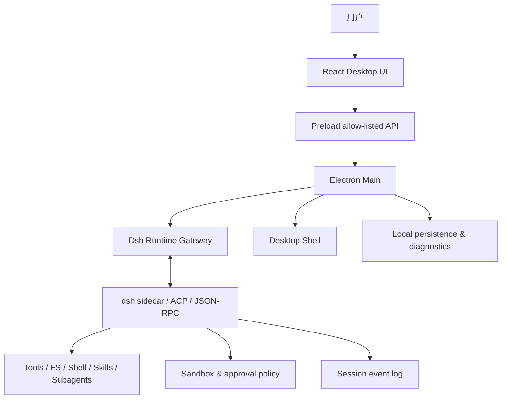

# DeepSeek DSH Desktop：产品头脑风暴

> 状态：概念探索，不是实现计划
>
> 目标：探索如何把 [DeepSeek Harness（dsh）](https://github.com/deepseek-ai/deepseek-harness) 魔改成一个类似 Codex Desktop 的桌面端产品，并落到当前 Electron Forge + Vite + React 18 模板上。
>
> 重要前提：dsh 仍处于 developer preview，未来可能有破坏性变更。本稿因此优先讨论产品边界、组合方式和可替换性，不假设 dsh 当前 API 已稳定。

## 1. 先给结论

最值得做的不是“给 dsh 套一个聊天窗口”，而是做一个 **本地优先的 Agent 工作台**：

- dsh 负责 agent runtime：模型适配、会话日志、工具编排、插件、子 Agent、计划、工作流、沙箱和审批。
- Electron 负责桌面产品：项目管理、多窗口、原生文件选择、终端、通知、快捷键、托盘、自动更新和跨平台打包。
- React GUI 负责把 Agent 的过程变成可理解、可审阅、可恢复的工作流：任务、计划、命令、diff、审批、产物和历史都可见。

产品的核心差异应是：**让用户放心地把一件真实工作交给 Agent，而不是只和模型聊天。**

## 2. dsh 能提供什么

以下是从 dsh 架构文档和使用指南提炼出的能力，分为“可以直接复用”和“需要桌面化包装”。

### 2.1 可以直接复用的 Agent 内核

| dsh 能力 | 对桌面产品的价值 | GUI 需要呈现什么 |
|---|---|---|
| 一切皆插件 | 模型、工具、存储、沙箱、UI 节点都可替换 | 插件/能力目录、启用状态、来源和版本 |
| Cordis 插件树 | 用 profile/bundle 组合不同工作模式 | “编码”“研究”“自动化”等工作区模板 |
| Session Event Log | 可恢复、可回放、可分叉、可审计 | 时间线、重播、从某一步 fork、导出记录 |
| Agent Loop | 多步模型请求、工具调用和继续执行 | 当前 step、等待原因、下一步、停止/继续 |
| Tool Registry + guarded pipeline | 统一工具发现、调用、策略和生命周期 | 工具调用卡片、风险等级、耗时、输出 |
| LLM adapter seam | 可接 DeepSeek 及 OpenAI-compatible provider | 模型、endpoint、key、上下文和 token 使用量 |
| Skills / plugin loader | 把团队工作流变成可复用能力 | Skill 安装、来源、说明、权限和启用范围 |
| Subagent / workflow | 并行调查、分工执行、后台任务 | Agent 树、任务队列、依赖、合并结果 |
| Plan / Todo | 将“目标”转化为可观察的执行过程 | 计划面板、步骤状态、阻塞点、重新规划 |
| Sandbox + approval | 控制文件、命令、网络和外部副作用 | 审批弹窗、权限范围、会话授权、策略解释 |
| Web / headless / SDK / ACP | 同一 runtime 可被 GUI、脚本和自动化使用 | 桌面 GUI 只是一个 client，不锁死其他入口 |

### 2.2 dsh 不会自动解决的桌面问题

- 当前工作区是什么、最近打开过哪些项目、如何切换项目。
- 用户如何快速理解 Agent 正在做什么，而不必阅读原始日志。
- 复杂 diff、命令输出、图片/音频/报告等产物如何并排审阅。
- Agent 卡住、崩溃、断网、电脑休眠后如何恢复。
- 权限申请如何做到“看得懂、批得准、可撤销”。
- 多个任务、多窗口、多显示器和系统通知如何协同。
- 如何在不暴露密钥的情况下支持本地配置、远程 provider 和团队策略。

这些正是 Electron Desktop 的产品空间。

## 3. 产品定位

### 3.1 一句话定位

**DeepSeek DSH Desktop 是一个把代码、文件、命令和团队工作流交给 Agent 协作完成的本地优先桌面工作台。**

### 3.2 目标用户

1. **个人开发者**：希望 Agent 直接进入项目、运行检查、修改代码并给出可审阅 diff。
2. **技术型产品/设计用户**：需要让 Agent 处理文档、调研、数据整理和自动化，而不想搭建命令行环境。
3. **团队/工作室**：需要共享 skills、权限策略、模型配置和可复盘的任务记录。
4. **插件作者**：希望为 dsh 增加模型、工具、连接器或领域工作流，并立即在桌面端使用。

### 3.3 不做什么

- 不把它定位成普通 IM 聊天客户端。
- 不在第一阶段自建云端 Agent 平台、团队后端或计费系统。
- 不把所有工具都默认开放给模型。
- 不把完整思维链作为产品卖点；展示可操作的摘要、计划、证据和结果。
- 不为了“像 Codex”复制每一个交互，而是借鉴其任务式工作流和审阅体验。

## 4. 三种产品路线

### 路线 A：Web UI 套壳

Electron 启动 dsh Web，然后在 BrowserWindow 中加载本地 Web UI。

**优点**：最快验证 dsh 能力，复用现有页面和协议，改动最少。

**缺点**：原生桌面体验弱；文件/终端/通知/多窗口/权限审批会被 Web 边界限制；UI 很难形成自己的产品差异。

**适合**：内部试用、技术验证、极早期 demo。

### 路线 B：Electron 原生 GUI + dsh sidecar（推荐）

Electron Main 启动并管理 dsh 进程，通过 ACP/JSON-RPC 或明确的本地 SDK 连接；React Renderer 是 dsh 的桌面客户端。

**优点**：runtime 与 GUI 松耦合，dsh 升级风险可隔离；可以真正做原生窗口、终端、审批、通知和恢复；未来能替换 dsh 或接多个 harness。

**缺点**：要做协议适配层、事件投影和生命周期管理；需要处理 sidecar 打包、版本、崩溃和跨平台路径。

**适合**：正式产品，也是当前模板最自然的落点。

### 路线 C：深度嵌入 dsh

把 dsh 的 packages 直接作为 Electron Main 的依赖，在同一进程内组装 Cordis profile。

**优点**：调用链短，类型和事件可以更直接；原生能力组合空间最大。

**缺点**：与 dsh 内部包结构强耦合；Electron 生命周期、Node 运行时和 dsh 插件生命周期容易互相污染；升级和排障成本高。

**适合**：等 dsh API 稳定、桌面端成为官方发行形态后再考虑。

**建议**：先采用路线 B。把“dsh runtime client”设计成独立适配器，保留未来内嵌的可能，但不让 UI 直接依赖 dsh 私有实现。

## 5. 产品形态：四个核心工作区

### 5.1 Projects：项目入口

左侧是项目和工作区，而不是一长串聊天。

- 最近项目、收藏项目、临时目录。
- 项目级模型、权限和 skills 配置。
- 项目状态：未提交变更、后台任务、运行中的服务。
- “新建任务”直接绑定当前项目，也可选择多个目录作为只读参考。

### 5.2 Task：任务工作台

主区域类似 Codex 的任务流，但更强调“证据”和“可控执行”。

- 顶部：任务标题、项目、模型、权限模式、运行状态。
- 中部：消息、计划、工具调用、命令输出、文件变更和产物时间线。
- 底部：自然语言输入、附件、停止/继续、追加约束、切换模型。
- 每一个 step 都能展开，看到“为什么调用”“输入范围”“输出摘要”和“下一步”。

建议提供三种视图：

1. **对话视图**：适合日常使用，默认隐藏低层细节。
2. **执行视图**：展示命令、工具、进程和实时日志。
3. **审阅视图**：集中展示 diff、测试结果、失败原因和待批准动作。

### 5.3 Review：结果审阅

任务完成不等于工作完成，Review 是产品的关键闭环。

- 文件树 + diff + inline comment。
- 按 Agent step、文件、风险等级和失败状态筛选。
- 一键接受、拒绝、撤销或要求 Agent 修改。
- 测试/类型检查/构建结果与对应文件变更关联。
- 支持生成 commit message、变更摘要、PR 草稿，但外部发布必须单独审批。

### 5.4 Library：能力与历史

- Sessions：全部任务、分组、标签、搜索、归档、fork。
- Skills：已安装、项目级、用户级、团队级和待更新。
- Models：DeepSeek、兼容接口、本地模型、速率和上下文设置。
- Policies：默认沙箱、命令策略、网络域名、敏感路径和审批记忆。
- Plugins：来源、权限、版本、依赖、最近错误。

## 6. 推荐的信息架构



一个任务的最小可理解单元不是“AI 回复”，而是：

```text
目标 → 计划 → step → 工具调用 → 证据 → 变更 → 审阅 → 结果
```

## 7. 与当前 Electron 模板的映射

当前仓库已经把 Main、Preload、Renderer、Contracts、Shared 分开，因此适合先搭“桌面壳 + 协议适配”，再逐步填充业务上下文。

### 7.1 Main：可信桌面编排层

建议的 bounded contexts：

- `runtime`：启动/停止 dsh sidecar、协议连接、版本能力探测、重连。
- `workspace`：项目目录、最近项目、工作区元数据。
- `session`：任务生命周期、事件流、恢复、fork、归档。
- `execution`：命令、进程、终端、超时、输出上限。
- `security`：沙箱、审批、敏感路径、网络和权限策略。
- `settings`：模型、凭据引用、profile、插件和用户偏好。
- `artifacts`：diff、测试结果、报告、图片和其他任务产物。

Electron lifecycle、BrowserWindow、菜单、托盘、快捷键和更新继续属于 `main/shell`，不应混入 dsh 业务上下文。

### 7.2 Preload：窄而稳定的 capability API

Renderer 不应该知道 dsh 的内部协议。可以考虑这样的产品级 API：

```ts
window.desktopApi.task.start(request)
window.desktopApi.task.sendMessage(taskId, message)
window.desktopApi.task.interrupt(taskId)
window.desktopApi.task.onEvent(listener)
window.desktopApi.workspace.list()
window.desktopApi.review.getDiff(taskId)
window.desktopApi.security.requestApproval(request)
```

这些方法应对应 `src/contracts/ipc` 的 DTO 和事件，不暴露 `ipcRenderer`、Node 模块或通用 invoke/send。

### 7.3 Renderer：以任务为中心的 UI contexts

- `workspace`：项目列表、项目切换、工作区状态。
- `task`：任务输入、时间线、状态、计划和 Agent 事件。
- `review`：diff、测试证据、接受/拒绝和回滚。
- `terminal`：持久终端、进程树、日志和重启。
- `library`：Session、Skills、Models、Plugins、Policies。
- `settings`：桌面、模型、凭据引用和快捷键。

`App.tsx` 只负责组合布局、providers 和路由，业务流程放在这些 contexts 中。

## 8. 核心数据与事件思路

### 8.1 以事件为事实来源

dsh 的 session log 很适合成为桌面端的事实来源。GUI 不应只保存一份“最终聊天记录”，而应投影出：

- `task/created`
- `user/message`
- `plan/updated`
- `step/started` / `step/completed`
- `tool/call` / `tool/result`
- `command/started` / `command/output` / `command/exited`
- `file/change/proposed` / `file/change/applied`
- `approval/requested` / `approval/decided`
- `artifact/created`
- `task/paused` / `task/failed` / `task/completed`

这样可以支持刷新恢复、断线重连、时间线重播、分叉和审计，也能避免 Renderer 自己猜测 Main 的真实状态。

### 8.2 运行时适配器

建议定义一个独立的 `DshRuntimeGateway` 概念，负责：

- 启动指定 profile/bundle。
- 建立 ACP/JSON-RPC 连接。
- 把 dsh 事件映射为产品事件。
- 将 GUI 的审批、用户输入和工具执行结果传回 dsh。
- 发现 runtime 能力和版本差异。
- 在 dsh 崩溃后恢复或明确标记任务为“需要恢复”。

GUI 只依赖这个适配器，不依赖 Cordis ctx、dsh 私有包路径或内部类。

## 9. “像 Codex”但更好用的关键交互

### 9.1 Composer：从一句话变成一个可控任务

输入框旁边显示当前执行上下文：

- 项目：`electron-template`
- 允许写入：当前工作区
- 网络：关闭 / 仅允许域名
- 模型：DeepSeek 当前 route
- Skills：项目默认 + 本次临时启用
- 计划模式：自动 / 先询问 / 强制计划

用户无需进入设置页就能意识到 Agent 的“手脚”在哪里。

### 9.2 工具调用卡片

每次调用都显示：

- 工具名和简短意图。
- 目标路径、cwd、网络和副作用。
- 风险标签：只读、可逆写入、外部副作用、破坏性。
- 输入摘要，敏感字段默认遮蔽。
- 输出摘要、耗时、退出码和相关文件。

### 9.3 审批不是弹窗打断，而是权限协商

审批面板应回答四个问题：

1. Agent 想做什么？
2. 影响哪些文件、进程、网络或外部系统？
3. 这次允许的范围是什么？
4. 允许一次、允许本任务，还是以后都不问？

默认按钮建议是“允许本次”，而不是永久信任。高危操作要提供明确的拒绝理由和替代建议。

### 9.4 计划与自由探索并存

- 简单问题：直接回答或执行。
- 多步骤任务：自动生成短计划。
- 高风险任务：先展示计划，再申请权限。
- 计划变化：保留旧计划，标记为何重排。

这样既不会让简单任务变成流程审批，也不会让复杂任务变成黑盒自动化。

### 9.5 多 Agent 的“导演台”

当 dsh 的 subagent/workflow 能力成熟后，增加一个可选的导演视图：

- 主 Agent：拆解目标、汇总结果。
- 子 Agent：代码探索、测试、文档、调研、审阅。
- 每个子 Agent 有独立上下文、权限和产物。
- 主 Agent 只能通过显式结果合并，避免多个 Agent 互相覆盖文件。

第一版不必做复杂 DAG 编辑器，先做 Agent 列表、状态和结果收件箱。

## 10. 安全与信任模型

### 10.1 三层防线

```text
能力层：dsh tool registry / plugin capability
    ↓
执行层：sandbox、路径、网络、进程和凭据隔离
    ↓
交互层：approval、策略记忆、diff 审阅、审计日志
```

三层不能互相替代：沙箱限制实际能力，审批决定是否放行，审阅帮助用户确认结果。

### 10.2 建议的权限档位

| 档位 | 默认能力 | 适用场景 |
|---|---|---|
| Safe | 只读工作区、无网络、无外部副作用 | 总结、解释、代码搜索 |
| Work | 工作区内写入、有限命令、逐次审批 | 日常编码和修复 |
| Dev | 持久进程、安装依赖、允许配置网络 | 本地开发和调试 |
| Automate | 连接器、外部写入、后台任务 | 发布、工单、团队自动化 |

权限应按项目保存，但每个任务允许临时降级；升级权限必须可见、可撤销。

### 10.3 必须优先处理的风险

- 工作区外路径、符号链接逃逸和敏感文件读取。
- shell 管道、重定向、解释器、下载后执行。
- `rm`、数据库破坏性命令、Git 历史改写、停止服务。
- 网络上传源码、密钥或个人数据。
- MCP/连接器的发消息、发布、删除和生产写操作。
- dsh 插件的来源、版本、权限和卸载能力。

## 11. MVP 建议

### MVP-0：可信桌面壳

- 项目选择与本地持久化。
- dsh sidecar 生命周期管理。
- 一个任务窗口：发送消息、流式事件、停止任务。
- 最小事件时间线。
- Safe / Work 两档权限。

### MVP-1：代码 Agent 工作台

- 文件浏览、搜索、diff 审阅。
- 命令执行和持久终端。
- 逐次审批、任务级授权、敏感路径保护。
- Session 恢复、归档、fork。
- 测试/类型检查/构建结果卡片。

### MVP-2：可扩展 Agent 平台

- Skills/Plugins 安装与管理。
- 多模型和 endpoint 配置。
- 子 Agent 和后台 workflow。
- MCP/ACP 外部连接。
- 团队策略导入导出。

### MVP-3：桌面级产品体验

- 多窗口、多显示器、全局快捷键、托盘和系统通知。
- 项目启动器、命令面板、最近任务搜索。
- 崩溃恢复、离线队列、诊断包和可观测性。
- macOS / Windows / Linux 的安装、签名、更新和卸载体验。

## 12. 成功标准

### 用户体验指标

- 用户能在 30 秒内从启动进入一个项目任务。
- 用户能在不打开终端的情况下完成“分析 → 修改 → 验证 → 审阅”。
- 用户能解释每个高风险动作为何发生，并能撤销或拒绝。
- 任务被中断后，用户能从最近一个可靠 step 继续。

### 工程指标

- Renderer 不直接依赖 Electron/Node。
- dsh 升级只需要修改 runtime adapter 和 contracts 映射，而不是重写 UI。
- 每个任务事件可重放，UI 状态可从事件恢复。
- 权限策略、工具调用和文件变更可审计。
- sidecar 崩溃不会拖垮 Electron 主进程或丢失已持久化任务。

## 13. 关键取舍

### 取舍一：内嵌还是 sidecar

建议 sidecar 优先。dsh 的插件化和快速迭代是优势，也意味着内部 API 会变；进程隔离能把升级、崩溃和依赖冲突限制在 runtime 适配层。

### 取舍二：事件原样转发还是产品事件

建议“保留原始事件 + 输出产品事件”。原始事件用于诊断和兼容，产品事件用于稳定 UI。不要让 React 组件直接理解 dsh 的内部事件树。

### 取舍三：默认自动化程度

建议默认 Work 档、逐次审批和工作区内写入。用户可以明确升级到 Dev/Automate，但不能通过一次模糊的“开始”隐式获得全部本机权限。

### 取舍四：插件市场是否首发

建议首发只支持本地目录、Git 地址或明确的 npm 包安装；插件市场、签名、评分和自动更新属于后续产品，不要把供应链问题藏在第一版 UI 后面。

## 14. 可能形成差异化的功能

1. **证据优先**：每个结论都能跳到文件、命令输出、测试或引用来源。
2. **可逆 Agent**：任务级 checkpoint、diff 分批应用、失败后回退和重跑。
3. **中文工作流**：中文计划、中文风险解释、中文 commit/变更摘要，同时保留英文代码语义。
4. **项目记忆但不泄密**：只保存用户批准的项目事实，不默认上传全仓库或敏感文件。
5. **本地插件生态**：让个人脚本、团队规范、领域工具和 dsh skill 变成可安装能力。
6. **导演台**：一个任务里可观察多个 Agent，而不是多个互不相干的聊天标签页。
7. **桌面自动化入口**：快捷键、拖入文件、选中文本后“交给 Agent”、系统通知后快速审批。

## 15. 最大风险与缓解

| 风险 | 后果 | 缓解 |
|---|---|---|
| dsh 预览期 API 变化 | 适配层频繁破坏 | sidecar、版本探测、协议 contract tests |
| Agent 执行误操作 | 文件损坏或数据外泄 | 沙箱 + 审批 + diff + 敏感路径策略 |
| 插件供应链风险 | 恶意代码取得本地能力 | 来源显示、权限声明、签名/校验、隔离安装 |
| 长任务体验差 | 用户不知道是否卡住 | step 状态、心跳、取消、恢复和后台通知 |
| 事件量过大 | UI 卡顿、存储膨胀 | 原始日志与 UI 投影分离、输出截断、归档策略 |
| 跨平台差异 | macOS/Windows/Linux 行为不一致 | 执行能力抽象、平台适配测试、清晰能力降级 |
| 过度复制 Codex | 产品没有自身价值 | 聚焦 dsh 插件生态、可观察执行和中文桌面体验 |

## 16. 一个推荐的最终形态



这套形态的本质是：

- **dsh 是可替换的 Agent 操作系统层**；
- **Electron Main 是可信桌面控制平面**；
- **Renderer 是任务、证据和审阅的用户界面**；
- **IPC contracts 是两者之间稳定的产品协议**。

## 17. 仍需尽早回答的问题

1. 首发只服务 DeepSeek，还是从第一天就支持 OpenAI-compatible provider？
2. dsh sidecar 是跟随应用内置，还是由用户安装并选择版本？
3. “项目”是否允许多个根目录、远程目录和容器目录？
4. 本地 session log 是否加密？用户是否可以选择完全不落盘？
5. 插件是否允许运行任意 Node 代码，还是必须声明 capability 并走沙箱？
6. 外部连接器的目标用户是个人自动化，还是团队工作流？
7. 首个杀手场景是“改代码”，还是“把一个复杂任务拆给多个 Agent”？

## 18. 最值得先验证的用户场景

```text
用户打开项目
→ 输入“帮我理解这个仓库，并修复当前类型错误”
→ Agent 先给出短计划
→ 读取文件并运行 typecheck
→ 用户批准工作区内修改
→ Agent 生成 diff
→ 用户逐文件审阅
→ Agent 再次运行 typecheck/lint
→ 用户接受变更并导出摘要
```

如果这个闭环在一个窗口里顺畅完成，产品就已经不是“聊天套壳”，而是一个有明确价值的 DSH Desktop 雏形。

## 19. 参考资料

- [DeepSeek Harness README](https://github.com/deepseek-ai/deepseek-harness/blob/master/README.md)
- [DeepSeek Harness Architecture](https://github.com/deepseek-ai/deepseek-harness/blob/master/docs/architecture.md)
- [DeepSeek Harness Web UI Guide](https://github.com/deepseek-ai/deepseek-harness/blob/master/docs/user/guide/index.md)
- 当前仓库的 [Main architecture](../src/main/ARCHITECTURE.md)
- 当前仓库的 [Renderer architecture](../src/renderer/ARCHITECTURE.md)
- 当前仓库的 [AGENTS.md](../AGENTS.md)

